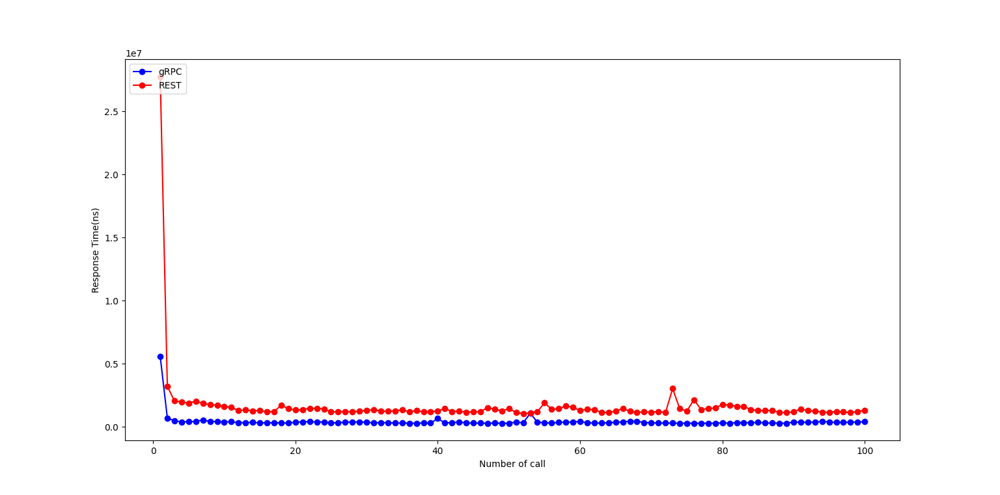
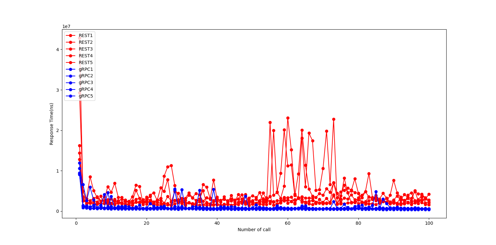
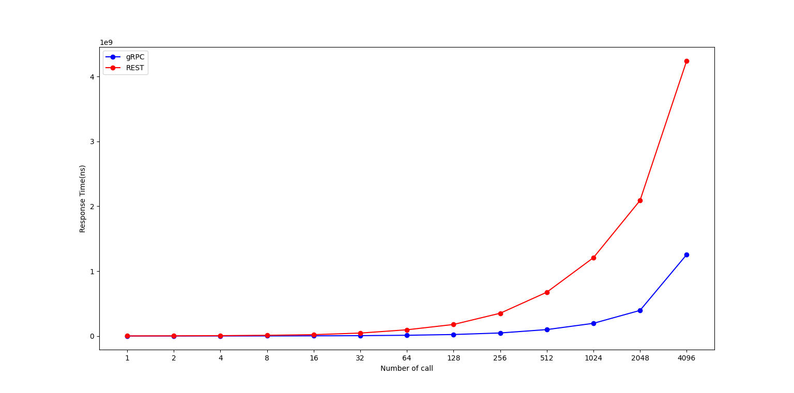
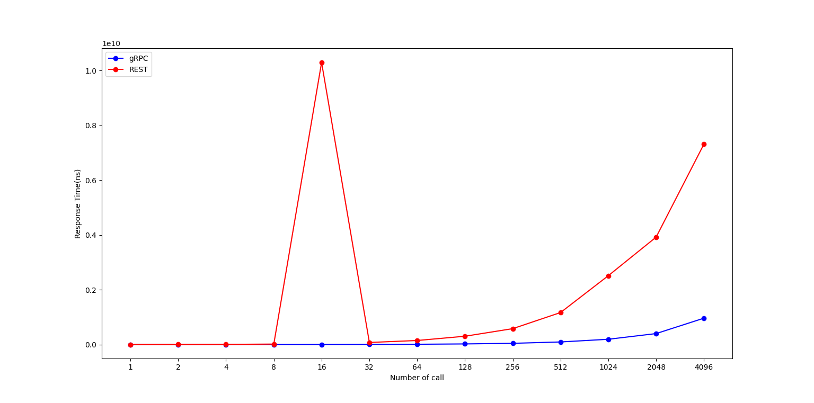
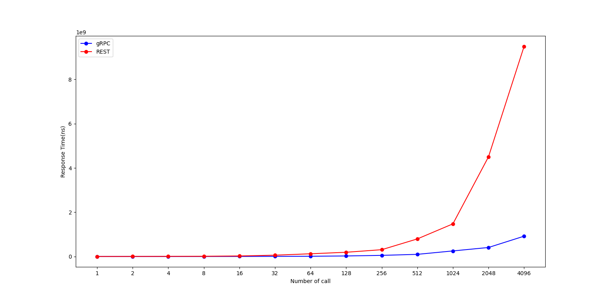
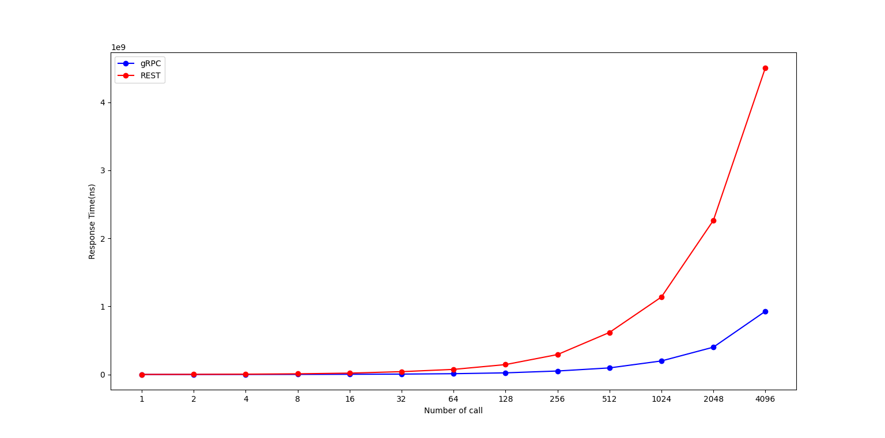

# Software Architecture - Assignment 2: gRPC and REST API benchmarking

## Members

- 6031031221 นิธิ อัศวพลากร
- 6031046721 ภูริณัฐ เทศวิเชียรชัย
- 6031062721 อิทธิธีต์ ลีลาชุติพงศ์
- 6031001421 กนกภัทร จินะณรงค์
- 6031308121 ณัชพล ศรีสังข์ 

## 1. Graphs showing the benchmark results wih the explanation of experimental setting

a1: Single client with a small call to insert a book item and a bigger call to insert a list of multiple book items

  ใน scenario นี้ใช้การเรียกฟังก์ชัน insert หลายๆครั้งต่อเนื่องแทนการ insert หนังสือหลายๆเล่ม จากกราฟพบว่าครั้งแรกที่มีการเรียกฟังก์ชัน insert จะใช้เวลานานกว่าอย่างเห็นได้ชัดเมื่อเทียบกับการเรียกครั้งถัดไป และการเรียกผ่าน GRPC นั้นทำได้เร็วกว่ากราเรียกผ่าน REST api

b: Multiple clients with different kind of calls

  ใน scenario นี้ใช้การสร้าง client ขึ้นมาและให้ทำการเรียกฟังก์ชันแบบสุ่ม ผลลัพธ์ที่ได้จะพบว่าการเรียกฟังก์ชั้นผ่าน REST api นั้นจะใช้เวลานานกว่า GRPC จะสังเกตได้จากกราฟเวลาที่ใช้ในการเรียกฟังก์ชันนั้นของRESTนั้นจะอยู่เหนือกราฟของGRPCเป็นส่วนใหญ่ 

c: Vary the number of concurrent calls from 1 to 4096 calls

  ใน scenario นี้จะทำการเรียกฟังก์ชันเป็นจำนวน 1,2,4,8,...,4096 ครั้ง ต่อการจับเวลาหนึ่งรอบ ผลลัพธ์ที่ได้คืออัตราการเพิ่มขึ้นของเวลาที่ใช้ในการเรียกฟังก์ชันของ REST api นั้นสูงกว่าของ GRPC อย่างเห็นได้ชัด และมีส่วนที่ error เล็กน้อยคือในรูปของฟังก์ชัน insert 

## 2. Discussion of the results why one method is better the other in which scenarios

gRPC is faster than REST because of these following reasons
1. 
2. 
3. 

## 3. Comparison of the gRPC and REST API from the aspects of language neutral, ease of use, and performance

| Aspect        | REST                      | gRPC                |
| ------------- | ------------------------- | ------------------- |
| Language Neutral    | Support Nearly every type of environment from mobile to web, Json libraries exist is most of programming language (and it’s just plain text)     | Support most popular languages and platform (C++, Java, Python, Go Ruby, C#, Objective-C, Javascript) In turn arguably not mature enough for production use         |
| Ease of Use  | write more code | write less code, High learning curve, Less support, Harder to debug directly        |
| Performance     | slower    | faster    |

## 4. Does results comply with the results in https://medium.com/@bimeshde/grpc-vs-rest-performance-simplified-fd35d01bbd4

