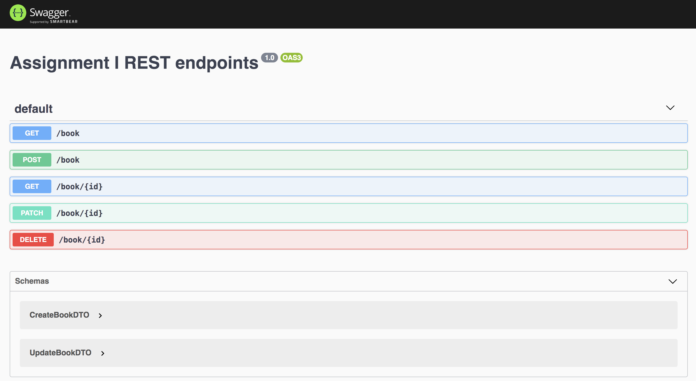

# Software Architecture - Assignment 1

## Members

- 6031031221 นิธิ อัศวพลากร
- 6031046721 ภูริณัฐ เทศวิเชียรชัย
- 6031062721 อิทธิธีต์ ลีลาชุติพงศ์
- 6031001421 กนกภัทร จินะณรงค์
- 6031308121 ณัชพล ศรีสังข์ 

## 1. Swagger screenshot

## 2. Source codes

- [Client](https://github.com/2110521-2563-1-Software-Architecture/TODO-assignment-1/tree/master/rest-client)
- [gRPC](https://github.com/2110521-2563-1-Software-Architecture/TODO-assignment-1/tree/master/GRPC)
- [REST](https://github.com/2110521-2563-1-Software-Architecture/TODO-assignment-1/tree/master/rest-api)

## 3. Comparation of REST and gRPC

| Functions     | gRPC                      | REST API            |
| ------------- | ------------------------- | ------------------- |
| List books    | `client.list({}, cb)`     | `GET /book`         |
| Insert books  | `client.insert(book, cb)` | `POST /book`        |
| Get books     | `client.get({id}, cb)`    | `GET /book/{id}`    |
| Delete books  | `client.delete({id}, cb)` | `DELETE /book/{id}` |
| Watch books   | `client.watch({})`        | N/A                 |

## 4. What are the main differences between REST API and gRPC?

gRPC uses Protocol buffer to serialize payload data, which is binary and smaller, while REST uses JSON, which is text and larger.

## 5. What is the benefits of introduce interface in front of the gRPC and REST API of the book services.

- The API is more clear to the user.
- Implementation detail can be hidden from the user, less confusions and easy swapping between implementations.
- Easier to maintain backward compatibility ex. keep the legacy interface working while building new ones.

## 6. Based on the introduced interface, compare how to call the methods based on gRPC and REST API side-by-side, e.g. in a table format as shown below.

| Functions     | gRPC                 | REST API             |
| ------------- | -------------------- | -------------------- |
| List books    | `Proxy.list()`       | `Proxy.list()`       |
| Insert books  | `Proxy.insert(book)` | `Proxy.insert(book)` |
| Get books     | `Proxy.get(id)`      | `Proxy.get(id)`      |
| Delete books  | `Proxy.delete(id)`   | `Proxy.delete(id)`   |
| Watch books   | `Proxy.watch()`      | N/A                  |

## 7. Draw a component diagram representing the book services with and without interfaces.
